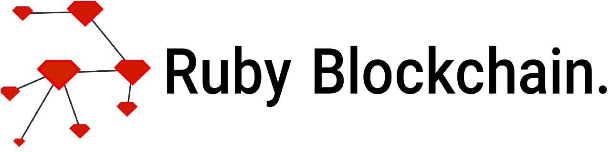

---

An implementation of a blockchain in pure ruby.

This project is currently in development. Current checklist:

+ ✔️ Implement Block
+ ✔️ Implement Blockchain
+ ✔️ Implement persistance
+ ✔️ Implement transaction and DataTransaction
+ ❌ Implement user interface
+ ❌ Create Wiki/how-to
+ ❌ Create Transaction validation
+ ✔️ Implement wallet generation
+ ❌ Optimize search-block efficiency
+ ❌ Create distributed peer-to-peer synchronization
+ ❌ Assure only the valid wallets can generate transactions from it
